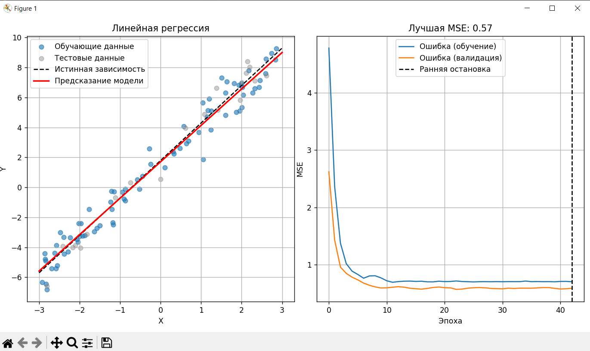
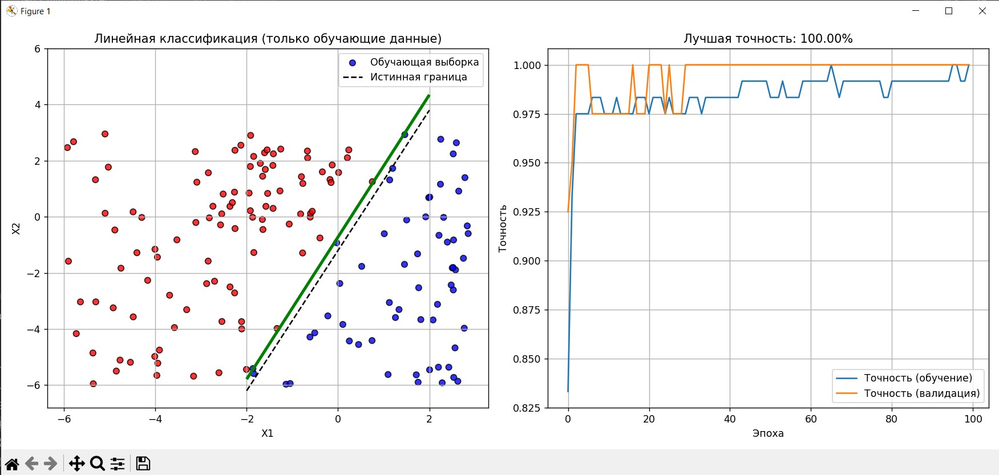
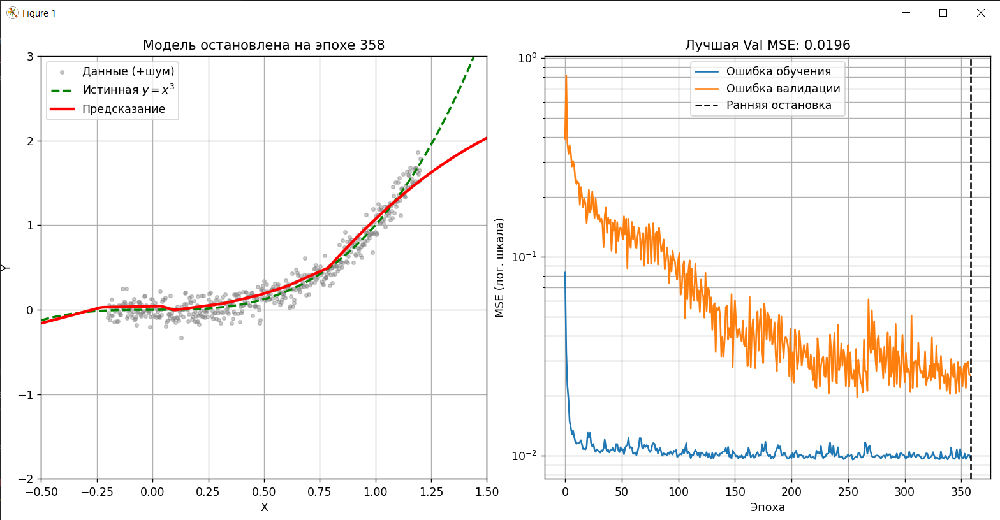

# Лабораторная работа по машинному обучению

### Задание
С помощью keras реализовать линейный классификатор, линейную и нелинейную регрессию.

### Результаты

#### Линейная регрессия

#### Линейная классификация  

#### Нейронная сеть (нелинейная регрессия)

